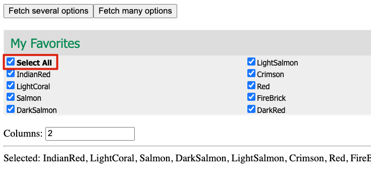

Recruitment ManualQa Homework MultiCheck Demo
=============================================

There is a page allows us to select options of "my favorites".

Click to open the target page: [My Favorites Page](./my-favorates.html)

The page has some basic functions:

1. When you click on the "Fetch several options" or "Fetch many options" buttons, the page will fetch some options and
   show in the "My Favorites" component.
2. When you change the number in "Columns", the options will be split into specified columns
3. When you select any options, it will be shown in the bottom after "Selected:" text
4. When you click on "Select All" option, it will select all options
5. When all options are checked, and you un-check any normal option, the "Select All" option will be unchecked

There are some requirements need to be verified.

Please note some requirements are implemented correctly, and some are not. You have the responsibility to give the final
sure result.

## What do you need to submit

We expect to get a screencast video with your voice which represents your operations and thinking of your checking.
Before you recording the screen, you may need to do some preparation to make the video short, clear and also contain
necessary information.

Your voice in the video is very important. We want to know what you are thinking and what is you point when you do any
operation. You can also talk about your understanding of any requirements, ask questions or show your ideas in the
video.

You can just use Chinese when speaking.

You can record several videos, one video for one requirement.

You can use any tools to capture the screen (with voice), and upload to the following site:

[https://wetransfer.com/](https://wetransfer.com/)

1. You don't need to register, but need to accept the "Cookies" and "Terms of Service"
   
   
   
   
2. Change config to select "Get transfer link"
   
   
3. Drag or selected video files to upload
3. Send the generated sharing url to us

## Required verifications

The following verifications are required to complete.

### Requirement 1

The special "Select All" option makes it easy to select all options. We need to verify its behavior.



**Acceptance Criteria:**

1. When we check "Select All", all other options should be checked
2. When we un-check "Select All", all other options should be un-checked
3. If "Select All" is not checked, and we manually checked all other options, the "Select All" should be checked
   automatically
4. If "Select All" is check, and we uncheck any other option, the "Select All" option should be un-checked
   automatically.

### Requirement 2

The "My Favorites" component on page has some styling requirements on its header, which is the part in the red rectangle
in following image:


**Acceptance Criteria:**

1. The header should have background color `#DDDDDD`
2. The header should have height `40px`
3. The font color of the title "My Favorites" should be `#088a52`
4. The font family should be `Tahoma`

### Requirement 3

When click on the "Fetch ??? options", the page will fetch some data from server and display on page. Please verify it
visits correct urls.


**Acceptance Criteria:**

1. When you click on the "Fetch several options", the url path should contain `/data/options1.json`
2. When you click on the "Fetch many options", the url path should contain `/data/options2.json`
3. The response of these urls should have content like following format:

```
[
  {
    "label": "IndianRed",
    "value": "IndianRed"
  },
  {
    "label": "LightCoral",
    "value": "LightCoral"
  }
]
```

### Requirement 4

When we specify different 'columns', the options will be grouped in specified columns.


There is a rule that if all the options can't be split equally, the first several columns should have same the count of
options, and only the last column can have fewer.

Which means the following is correct:

```
OPTION   OPTION    OPTION
OPTION   OPTION    OPTION
OPTION   OPTION  
```

The following is not:

```
OPTION   OPTION    OPTION
OPTION   OPTION    OPTION
         OPTION
```

**Acceptance Criteria:**

1. No matter what the 'columns' is, the first several columns should have options with same count, and only the last
   column can have equal or fewer options.

## Advanced Verifications

The following verifications need more skills or tools. It's not required to complete them, but you will get extra points
if you do.

### Requirement 5

When we select any options, the page will try to save the selected options in browser cookies, as following format:

```
myFavorites=option1,option2
```

Please verify this functionality.

**Acceptance Criteria:**

1. Selected options should be saved in browser cookie as specified format. Say, if I selected following options:


I should see `myFavorites=IndianRed,Salmon` in the cookie.

### Requirement 6

The "My Favorites" have a hidden feature: when the text of an option is a single letter string, the color of it will be
red.

Like following:


But currently the fetched options don't have such an option. You need to use some tools, e.g. some browser extension or
some tools which can capture the http requests and response, and allow us to modify the response content to add such an
option:

```
, {
  "label": "A",
  "value": "A"
}
```

**Acceptance Criteria:**

1. If the text of an option is a single letter string, its font color should be red


